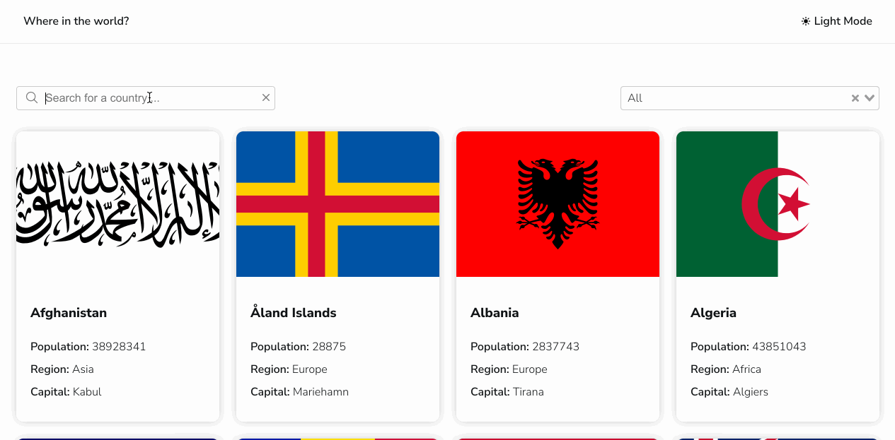

# Discover Countries

This project is coded for Frontend Mentor REST Countries API with color theme switcher challenge.
REST Countries V2 API was used to retrieve country datas.

## Preview Link

You can preview the app [here](https://discover-countries-10xtlieac-mchtugr.vercel.app/).

## Screenshots



## Run locally

Clone the project

```bash
  git clone https://github.com/mchtugr/discover-countries.git
```

Go to project directory

```bash
  cd discover-countries
```

Install dependencies

```bash
  npm install
```

Run the app

```bash
  npm run serve
```

## Built with

- VueJs
- Vuex
- Vue Select
- Vue Router
- Axios
- SCSS

## Contributing

Pull requests are welcome.
For major changes, please open an issue first to discuss what you would like to change.

## License

[MIT](https://choosealicense.com/licenses/mit/)
